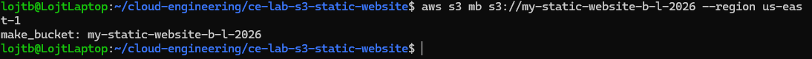
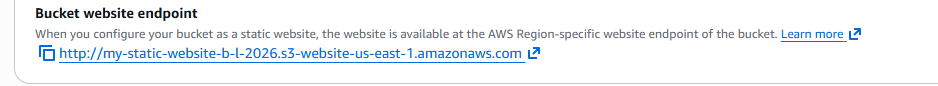
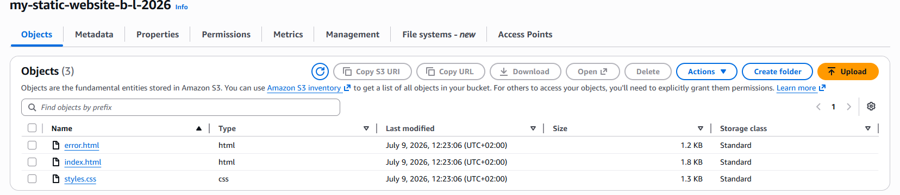
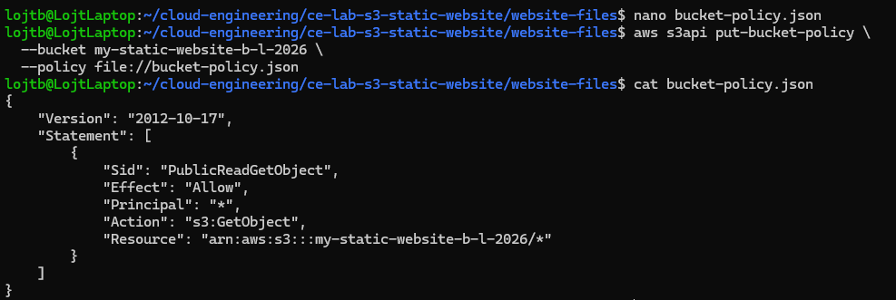
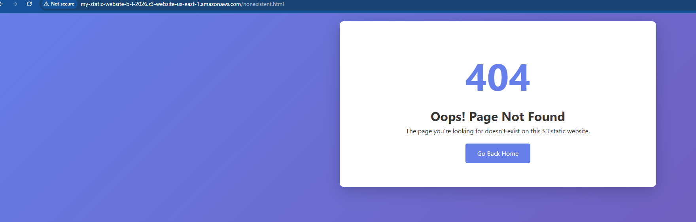

# Lab Solution: Host a Static Website on Amazon S3

**Student Name:** Balint Lojt  
**Date:** 09/07/2026  
**Lab Completion Time:** ___________ minutes

---

## Part 1: Bucket Configuration

### Bucket Information

**Bucket Name: my-static-website-b-l-2026

**Region: us-east-1

**Bucket Website Endpoint URL:**
```
___________________________________________________________
```

**Screenshot 1: Bucket Creation Confirmation**


---

## Part 2: Static Website Hosting Configuration

### Configuration Details

**Index Document:** --index-document index.html

**Error Document:** --error-document error.html

**Screenshot 2: Static Website Hosting Settings**

---

## Part 3: Website Files

### Files Created

List the files you created:
1. ___________________________
2. ___________________________
3. ___________________________

**Did you customize the HTML/CSS?** (Yes/No): ______

**If yes, describe your customizations:**
```
_____________________________________________________________
_____________________________________________________________
_____________________________________________________________
```

**Screenshot 3: Files Uploaded to S3**


---

## Part 4: Bucket Policy

### Bucket Policy Applied

**Paste your complete bucket policy here:**
```json
{
  "Version": "2012-10-17",
  "Statement": [
    {
      
      
      
      
    }
  ]
}
```

**Screenshot 4: Bucket Policy Configuration**


---

## Part 5: Testing and Verification

### Website Testing

**Website URL (from endpoint):**
```
___________________________________________________________
```

**Did the website load successfully?** (Yes/No): ______

**Did the CSS styling apply correctly?** (Yes/No): ______

**Screenshot 5: Working Website**


### Error Page Testing

**Test URL used:**
```
___________________________________________________________
```

**Did custom error page display?** (Yes/No): ______

**Screenshot 6: Custom 404 Error Page**


---

## Part 6: CLI Commands Used

**Document all AWS CLI commands you executed:**

```bash
# Bucket creation


# Enable website hosting


# Upload files


# Apply bucket policy


# Verify configuration


```

---

## Bonus Challenges Completed

- [ ] Challenge 1: Added about.html page
- [ ] Challenge 2: Used subdirectories for organization
- [ ] Challenge 3: Used `aws s3 sync` command

**Bonus Challenge Notes:**
```
_____________________________________________________________
_____________________________________________________________
_____________________________________________________________
```

---

## Reflection Questions

### 1. What are the advantages of S3 static hosting compared to traditional web servers?

**Your answer:**
```
_____________________________________________________________
_____________________________________________________________
_____________________________________________________________
_____________________________________________________________
```

### 2. Why is a bucket policy necessary for public website access?

**Your answer:**
```
_____________________________________________________________
_____________________________________________________________
_____________________________________________________________
```

### 3. What are the limitations of S3 static website hosting?

**Your answer:**
```
_____________________________________________________________
_____________________________________________________________
_____________________________________________________________
```

### 4. When would you NOT use S3 for website hosting?

**Your answer:**
```
_____________________________________________________________
_____________________________________________________________
_____________________________________________________________
```

### 5. How does S3 static hosting fit into cost optimization strategies?

**Your answer:**
```
_____________________________________________________________
_____________________________________________________________
_____________________________________________________________
```

---

## Troubleshooting Log

**Did you encounter any issues?** (Yes/No): ______

**If yes, document the issues and how you resolved them:**

| Issue | Error Message | Solution | Time to Resolve |
|-------|--------------|----------|-----------------|
|       |              |          |                 |
|       |              |          |                 |
|       |              |          |                 |

---

## Cleanup Confirmation

- [ ] Emptied S3 bucket
- [ ] Deleted S3 bucket
- [ ] Verified no resources remain

**Cleanup CLI commands used:**
```bash
# Empty bucket


# Delete bucket


```

---

## Self-Assessment

**Rate your understanding of each concept (1-5, where 5 is expert):**

| Concept | Rating | Notes |
|---------|--------|-------|
| S3 bucket creation | ___/5 | |
| Static website hosting configuration | ___/5 | |
| Bucket policies and public access | ___/5 | |
| Uploading and managing S3 objects | ___/5 | |
| S3 website endpoints | ___/5 | |
| HTML/CSS basics | ___/5 | |

---

## Instructor Verification

**Instructor Name:** ___________________________

**Date Reviewed:** ___________________________

**Website URL Verified:** ☐ Yes ☐ No

**Comments:**
```
_____________________________________________________________
_____________________________________________________________
_____________________________________________________________
```

**Grade/Status:** ___________________________

---

## Additional Resources Referenced

List any documentation, tutorials, or resources you used:

1. ___________________________________________________________
2. ___________________________________________________________
3. ___________________________________________________________

---

**Lab Status:** ☐ Complete ☐ Needs Revision

**Total Time Spent:** ________ minutes

**Submission Date:** ___________________________
